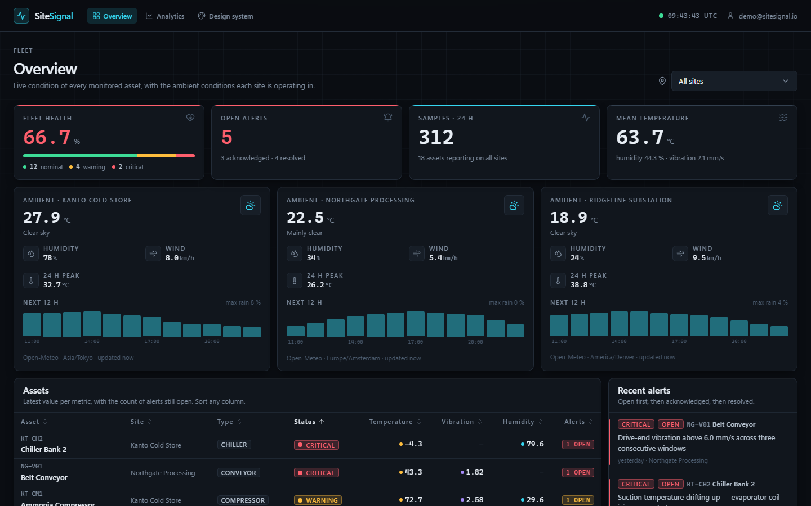
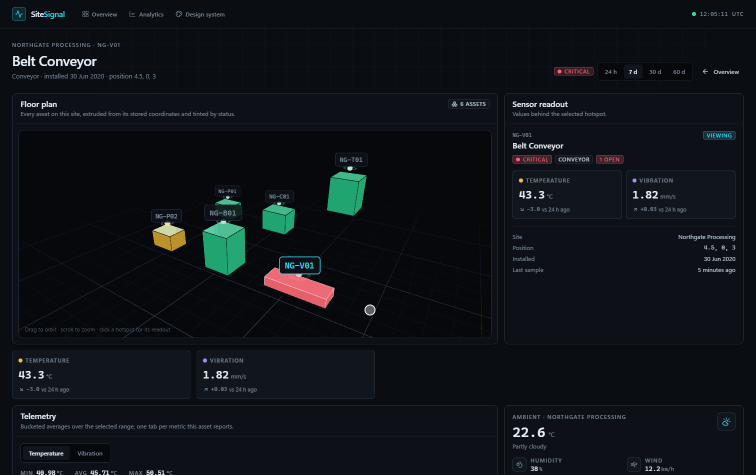
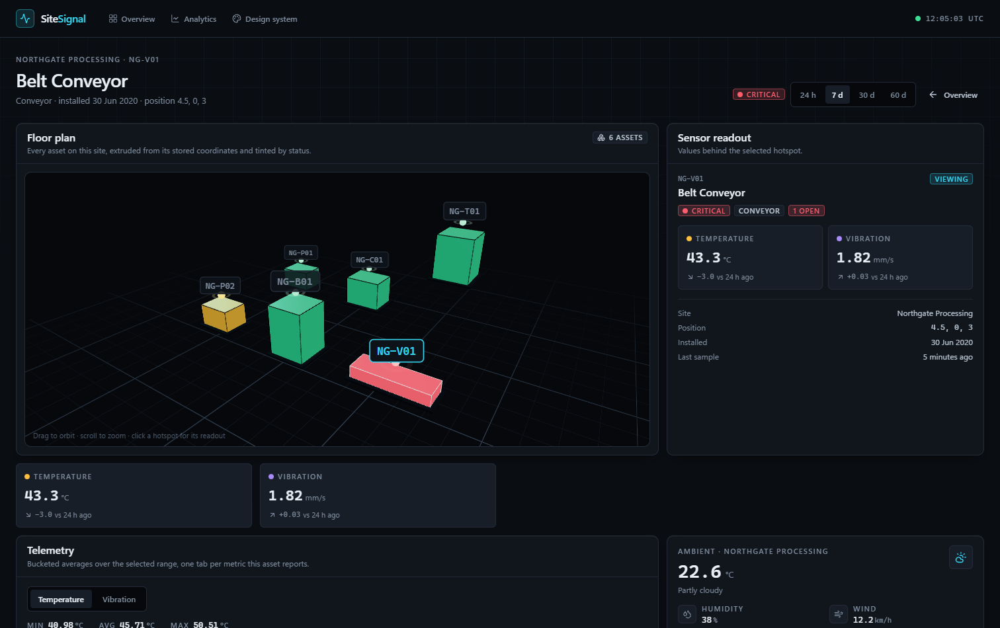
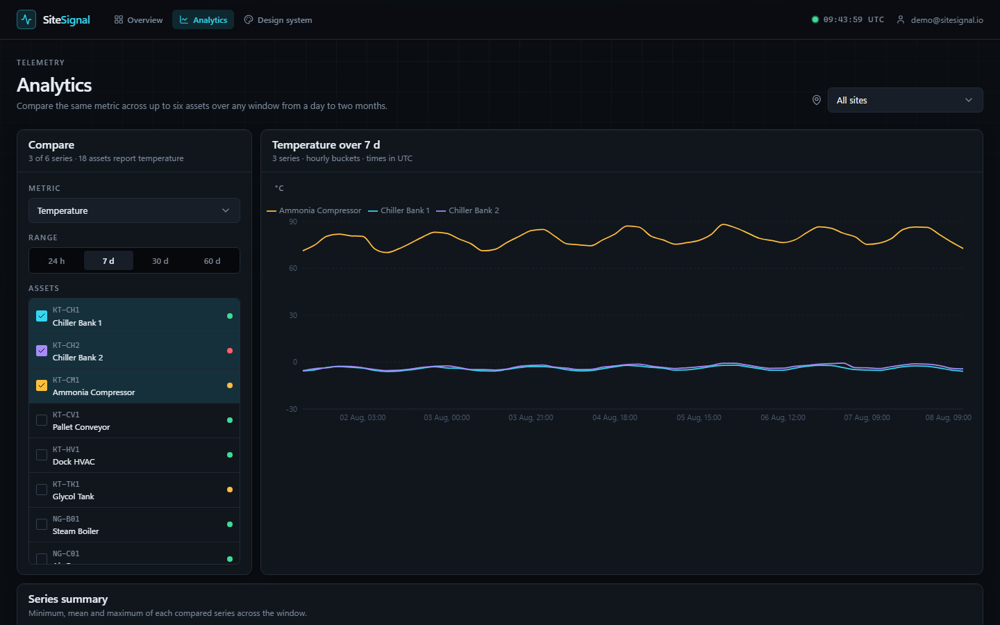
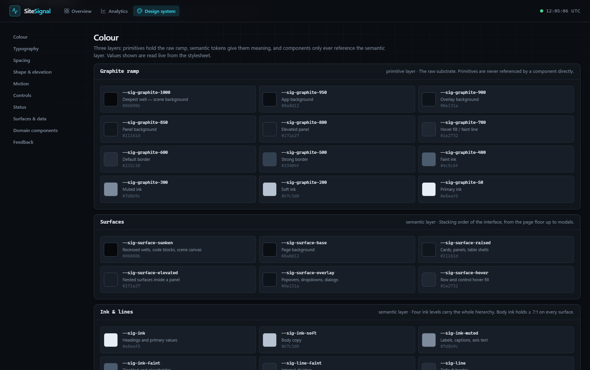

# SiteSignal

[](#testing)
[](#deploy)
[](#tech-stack)

**Live demo: [https://sitesignalui.vercel.app](https://sitesignalui.vercel.app)**

SiteSignal is an industrial asset monitoring dashboard. It ships with real telemetry data — 3 industrial sites, 18 machines, 60 days of readings — an interactive 3D floor plan, multi-asset analytics, authentication, multi-tenancy, a documented design system, and a 193-test suite. Replace the seed data with your own IoT pipeline and you have a production-ready monitoring platform.





---

## Key Features

- **Interactive 3D Floor Plan** — Built with react-three-fiber. Clickable hotspots pulse by severity, orbit controls let you navigate the space, and selecting a hotspot loads real-time sensor data into a side panel.
- **Multi-Asset Analytics** — Compare the same metric across up to six assets over 24 h / 7 d / 30 d / 60 d windows, with aggregated stats and per-series summaries. Charts render from real bucketed readings, not mock data.
- **Live Overview Dashboard** — KPI cards, sparkline-style metric highlights, fleet distribution, sortable asset table with sticky headers, per-site weather forecasts, and a live alert feed.
- **Design System** — A living `/design-system` route renders every color token, type scale, spacing unit, and component variant live.
- **Production Architecture** — React 19, Vite 8, Express 5, Drizzle ORM, PostgreSQL (PGlite for zero-config local dev). The same code runs locally, in Docker, and on Vercel serverless functions.
- **193 Tests** — Full Vitest suite covering utilities, components, and API routes, with coverage reporting built in.
- **Multi-tenancy** — Organizations, role-based access (admin/member/viewer), and data isolation. Ready for SaaS deployment.
- **Magic Link Auth** — Passwordless login with secure session cookies, rate limiting, and security headers.

---

## Quick Start

```bash
git clone https://github.com/albertoguinda/sitesignal.git
cd sitesignal
npm install
npm run dev
```

Open [http://localhost:5000](http://localhost:5000). PGlite runs embedded — no database server required. The seed data (3 sites, 18 machines, 60 days of telemetry) is already loaded.

Requires Node 24.

---

## Deploy

### Vercel (recommended)

```bash
npx vercel --prod
```

The project includes a `vercel.json` with serverless function routing — the Express API and the static client deploy as one project. The production build (`tsc -b && vite build`) runs in CI-grade checks on every deployment.

### Docker

```bash
docker compose up
```

Multi-stage Dockerfile produces a minimal production image; the compose file includes PostgreSQL. One command, full stack.

### Anywhere Else

```bash
npm run build
npm start
```

Binds to port 5000. Set `DATABASE_URL` for external PostgreSQL, or leave it unset for embedded PGlite.

---

## How to Make It Yours

**1. Connect your own sensors**

Replace the seed data in `server/db/seed.ts` with your IoT telemetry pipeline. The schema in `server/db/schema.ts` defines `readings` and `alerts` — insert rows from MQTT, HTTP webhooks, or any ingestion path.

**2. Change the floor plan**

Edit the 3D scene in `src/components/asset-scene.tsx`. The `Hotspot` component accepts severity levels and triggers the panel update. Swap the geometry for your own facility layout.

**3. Adjust the data model**

Add new asset types in `shared/types.ts`, extend the schema in `server/db/schema.ts`, run `npm run db:generate`, and the API + UI follow the shared contract.

---

## Architecture

```
PRESENTATION        React 19 + Vite 8 + Tailwind v4 + react-three-fiber
      |
APPLICATION         TanStack Query + React Router v8 + Auth context
      |
DOMAIN              shared/types.ts (TypeScript contract between client/server)
      |
INFRASTRUCTURE      Express 5 + Drizzle ORM + PostgreSQL (PGlite or external)
```

The type contract in `shared/types.ts` is the single source of truth. Server and client both import from it — no drift, no `any`.

| Layer | Tech | Purpose |
|-------|------|---------|
| Frontend | React 19, Vite 8, Tailwind v4 | UI, 3D rendering, styling |
| State | TanStack Query | Server state, caching, refetching |
| Routing | React Router v8 | Client routes, nested layouts |
| 3D | react-three-fiber + drei | Interactive floor plan |
| Charts | Recharts | Analytics time series |
| API | Express 5, Zod validation | REST endpoints, input validation |
| ORM | Drizzle ORM | Type-safe SQL, migrations |
| Database | PostgreSQL (PGlite embedded) | Zero-config local, production-ready |
| Auth | Magic links + HTTP-only cookies | Passwordless, secure sessions |

---

## Tech Stack

| Category | Technology | Version |
|----------|-----------|---------|
| Runtime | Node.js | 24.x |
| Frontend | React | 19.2 |
| Build | Vite | 8.2 |
| Styling | Tailwind CSS | v4 |
| 3D | react-three-fiber | 9.7 |
| Charts | Recharts | 3.10 |
| API | Express | 5.2 |
| ORM | Drizzle | 0.45 |
| Database | PostgreSQL / PGlite | embedded |
| Validation | Zod | 4.4 |
| Testing | Vitest | 4.1 |
| TypeScript | TypeScript | 7.0 |
| Containers | Docker | multi-stage |

---

## Screenshots

| View | Description |
|------|-------------|
|  | **Dashboard** — KPI cards, per-site ambient conditions, sortable asset table, live alert feed |
|  | **3D Floor Plan** — Click a pulsing hotspot, sensor panel updates in real time |
|  | **Asset Detail** — Full telemetry view for a single machine with 3D context |
|  | **Analytics** — Multi-asset metric comparison with aggregated stats and series summary |
|  | **Design System** — Every token, type scale, and component rendered live at `/design-system` |

---

## Testing

```bash
# Run all 193 tests
npm test

# Single run (CI mode)
npm run test:run

# Coverage report
npm run test:coverage

# Type checking (strict, zero any)
npm run typecheck
```

Tests live in `src/lib/__tests__/` and `server/__tests__/` and use Vitest with Testing Library.

---

## Environment Variables

| Variable | Default | Description |
|----------|---------|-------------|
| `NODE_ENV` | `development` | Environment mode |
| `PORT` | `5000` | Server port |
| `DATABASE_URL` | *(none)* | PostgreSQL connection string (omit for PGlite) |
| `PGLITE_DIR` | `./data/sitesignal` | PGlite data directory |
| `BASE_URL` | `http://localhost:5000` | Base URL for magic links |

---

## Credits

- Ambient conditions by [Open-Meteo](https://open-meteo.com)
- Embedded Postgres by [PGlite](https://pglite.dev)
- UI components by [Radix UI](https://www.radix-ui.com/)
- Icons by [Lucide](https://lucide.dev/)
- 3D rendering by [react-three-fiber](https://github.com/pmndrs/react-three-fiber)

---

MIT — see [LICENSE](./LICENSE)
